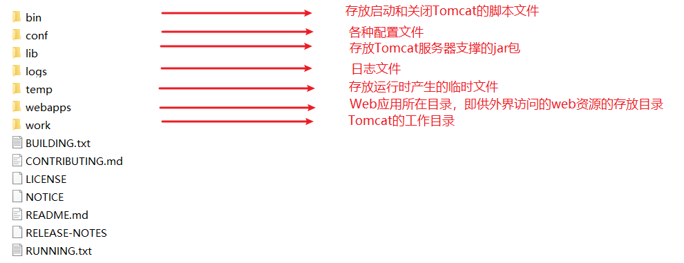
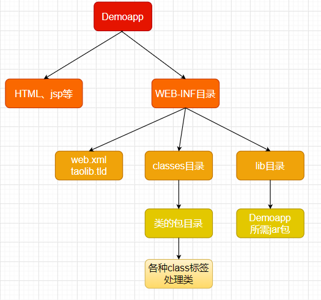
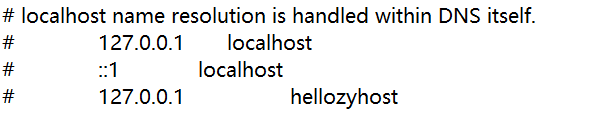
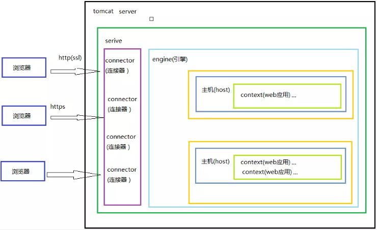
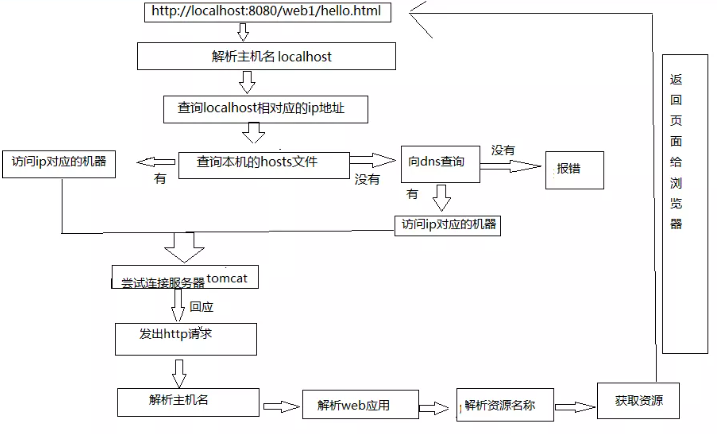

# Java

### JSP

#### JSP简介
JSP全称Java Server Pages，是一种动态网页开发技术。它使用JSP标签在HTML网页中插入Java代码。标签通常以<%开头以%>结束。
JSP是一种Java servlet，主要用于实现Java web应用程序的用户界面部分。网页开发者们通过结合HTML代码、XHTML代码、XML元素以及嵌入JSP操作和命令来编写JSP。
JSP通过网页表单获取用户输入数据、访问数据库及其他数据源，然后动态地创建网页。
JSP标签有多种功能，比如访问数据库、记录用户选择信息、访问JavaBeans组件等，还可以在不同的网页中传递控制信息和共享信息。

#### JSP处理
以下步骤表明了Web服务器是如何使用JSP来创建网页的：

就像其他普通的网页一样，您的浏览器发送一个HTTP请求给服务器。
Web服务器识别出这是一个对JSP网页的请求，并且将该请求传递给JSP引擎。通过使用URL或者.jsp文件来完成。
JSP引擎从磁盘中载入JSP文件，然后将它们转化为servlet。这种转化只是简单地将所有模板文本改用println()语句，并且将所有的JSP元素转化成Java代码。
JSP引擎将servlet编译成可执行类，并且将原始请求传递给servlet引擎。
Web服务器的某组件将会调用servlet引擎，然后载入并执行servlet类。在执行过程中，servlet产生HTML格式的输出并将其内嵌于HTTP response中上交给Web服务器。
Web服务器以静态HTML网页的形式将HTTP response返回到您的浏览器中。
最终，Web浏览器处理HTTP response中动态产生的HTML网页，就好像在处理静态网页一样。

#### JSP示例

```jsp
<!--
  <%--这是JSP注释--%>
 -->
<html>
<head>
<title>Hello World</title>
</head>
<body>
Hello World!<br/>
<%
out.println("Your IP address is " + request.getRemoteAddr());
%>
</body>
</html>
```


### 单元测试Junit

**黑盒白盒**

“盒”：介于输入与输出之间。
运行时“盒”可视为白盒，不可视为黑盒。（即看不看得见过程）。

**单元测试（建议）**

1. 定义测试类
* 包名定义为：XXX.XXX.test   eg：com.zy68.test
* 类名为XXXTest    eg：CalculatorTest

2. 定义测试方法
* 方法命名：testXXX    eg：testAdd()
* 返回值：void
* 参数列表：空参

3. 给方法加测试注解 \@Test
4. 导入Junit依赖环境

5. 处理结果：可以用断言

```java
Assert.assertEquals(期望的结果,将要判断的结果);
Assert.assertEquals(3,testAdd(2+2));
/*断言正确：无返回结果；
*/
/*断言错误：
java.lang.AssertionError:
预期:3
实际:4
*/
```
6. 补充的注解

\@Before 
在所有的测试方法实现前都先实现有\@Before注解修饰的方法

\@After
（与\@before对应）在所有的方法都实现后才实现\@After注解修饰的方法。
> 这用了这两个注解的的方法，不论是否手动运行，它都会自动运行


### 反射

框架设计的灵魂（即主要用于设计框架）

反射：将类的各个组成部分封装为其他对象，即反射机制。

好处：
* 可在程序运行中操作对象，如在编码时：System.out.…… 每一个点之后显示的就是对象，即整个IDE在运行中，可以操作对象来使用
* 可以解耦，提高程序可扩展性。

### 注解

用在包、类、字段等前面，用来对这些元素进行说明、注释。
作用分类：
1. 编写文档：通过代码里表示的注解生成文档【生成doc文档】
2. 代码分析：通过代码里标识的注解对代码进行分析【使用反射】
3. 编译检查：通过代码里标识的注解让编译器能够实现基本的编译检查【override】

#### jdk中的内置注解

\@Override:检查被标注的方法是否继承自父类

\@Deprecated：表示方法已过时，但还是可以用。调用时会有删除线。

\@SuppressWarnings：压制警告warning

> 一般传递参数all：@SuppressWarnings("all")


### Tomcat

Tomcat简单的说就是一个运行JAVA的网络服务器，底层是Socket的一个程序，它也是JSP和Serlvet的一个容器。

#### 一、Tomcat三个功能：
1. Web服务器
2. jsp容器
3. Servlet容器。

#### 二、Tomcat文件目录介绍


注，重点说明：
1. **conf目录**：
* server.xml 文件用于配置server相关信息；
* web.xml 文件配置与web应用（web应用相当于一个web站点）
* tomcat-user.xml 配置用户名密码及相关权限。

2. **work目录**：
用于存放jsp被访问后生成的对应的server文件和.class文件

3. **webapps目录**：
* 存放web应用。
* 使用：在webapps目录下新建文件夹（内包含.html、WEB-INF、jsp、图片等文件），用于存放web应用
> WEB-INF目录用于对web应用做设置、调整等。主要是**web.xml**配置文件的配置使用。

**一个web应用的目录结构：**


#### 三、配置虚拟目录

虚拟目录：一个**映射**，把分放在其他磁盘的web应用映射到webapps目录下。即记录指向其他web应用的路径，使得在要访问时，Tomcat能够找到它并运行。

> 默认只有在webapps目录下的web应用才能被Tomcat自动管理成一个web站点。

1. 法一：在Tomcat的conf/server.xml文件中**添加**如下代码
```xml
# path表示的是访问时输入的web项目名，docBase表示的是站点目录的绝对路径。
# 下例的代码背景：名称为 Demo1 的web应用放在D盘下
<Context path="/Demo1" docBase="D:\Demo1"/>
```
2. 法二：到conf\Catalina\localhost文件下，创建一个xml文件，**该文件的名字就是站点的名字**。`.xml`文件内容如下
```xml
<?xml version="9.0" encoding="UTF-8"?>
<Context
        docBase="D:\Demo1"
        reloadable="true">
</Context>
```

#### 四、配置临时域名

**访问Tomcat服务器的几种方式：**
1. 使用`localhost`域名访问
2. 使用ip地址`127.0.0.1`访问【该ip地址也是本机】
3. 使用主机名访问【只限于本机上或局域网】[#？？？我还不懂？？？答：内网DNS解析#](https://qastack.cn/unix/16890/how-to-make-a-machine-accessible-from-the-lan-using-its-hostname)
4. 使用本机IP地址访问【在cmd中输入ipconfig可以查询到本机的IP地址】
5. 为机器配置临时域名

**配置临时域名**
1. 到 C:\Windows\System32\drivers\etc下，找到hosts文件
2. 添加、保存如下，然后即可通过http://hellozyhost访问本机了。


> 说到底是使用本机的DNS解析

#### 五、设置虚拟主机

虚拟主机：**多个**不同域名的网站共存在一个Tomcat中。
即：一个主机的情况下，一个Tomcat只能运行一个网站。如果我不配置虚拟主机，那么我需要多个电脑中的Tomcat来运行每一个域名的网站。

**配置虚拟主机**
在tomcat的server.xml文件中添加主机名
```xml    
<Host name="zy" appBase="D:\Demo1">                   
<Context path="/Demo1" docBase="D:\Demo1"/>
</Host>
```
???????我怎么设置虚拟主机呢？？？？？？？

#### 六、Tomcat体系结构



#### 七、web访问流程



#### 参考
[3y——《Tomcat就是这么简单》](https://mp.weixin.qq.com/s?__biz=MzI4Njg5MDA5NA==&mid=2247484755&idx=2&sn=b09e747bd0af5e1899a47911f92d1afe&chksm=ebd74452dca0cd44ebbcdacab7373a72d0c769746eaa2bfa454d1dbc8295e3f93b0645c0ac58###rd)

***
***

### Servlet----[Oracle docs](https://docs.oracle.com/javaee/7/api/)

Servlet(server applet)：运行在服务器上的小程序
> Servlet就是一个**接口**，定义了Java类被浏览器访问到tomcat识别的规则。

执行原理
1. 当服务器接收到客户端浏览器的请求后，会解析请求URL路径，获取访问的servlet的资源路径；
2. 查找web.xml文件，是否有对应的<url-pattern>标签体内容；
3. 如果有，则再找到对应的<servlet-class>全类名；
4. Tomcat会将字节码文件加载进内存，并且创建其对象；
5. 调用其方法