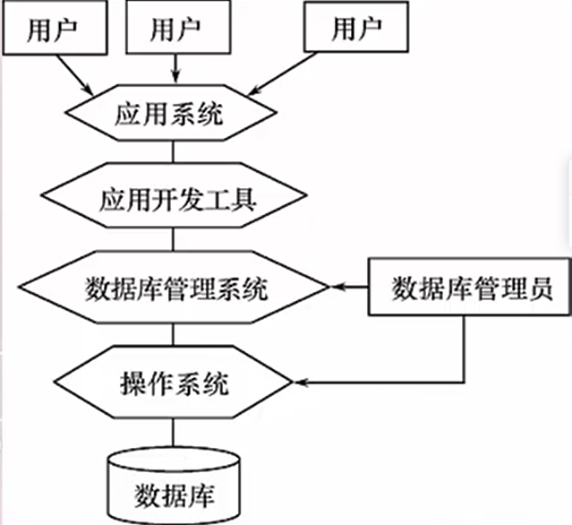

# 数据库

## 四个概念

1. **数据**（Data）：描述事物的符号记录称为数据，是数据库中存储的基本对象。数据的含义成为数据的**语义**。
2. **数据库**（DataBase，DB）：**长期存储**在计算机内的、**有组织**的、**可共享**的**大量数据的数据集合**。

>数据库中数据的特点:
>
>* 数据永久存储；
>* 数据可共享；
>* 数据有组织。

3. **数据库管理系统**（DataBase Management System， DBMS）：一个用于科学地组织和存储数据，高效地获取和维护数据的软件系统。
4. **数据库系统**（Database System，DBS）: 是指在计算机系统中引入数据库后的系统构成。在不引起混淆的情况下常常把数据库系统简称为数据库。
5. 数据库管理员（DataBase Administrator,DBA）

部分之间的关系


数据管理：对数据进行分类、组织、编码、存储、检索和维护。
数据管理三阶段：人工管理->文件系统->数据库系统

### 数据模型

**模型**：对现实世界中某类对象特征的模拟和抽象。建模是认识现实世界事物的一种方法。
**数据模型**：现实世界数据特征的抽象，是数据库系统的**核心和基础**。建立数据模型是计算机处理现实世界问题的一种方法。其应具有三个**基本特征**：
* 能比较真实地模拟现实世界；
* 容易为人所理解；
* 便于在计算机上实现。
两个层次的数据模型：概念模型（人为-面向用户进行建模）->逻辑模型（人为-面向计算机进行建模）->物理模型（DBMS-数据底层的抽象）

**数据模型三要素**：数据结构、数据操作、完整性约束

### 关系数据库

关系-》关系模型-》关系数据库

码
一个关系可以有多个候选码（主属性），但只能有一个主码，主码属于候选码。候选码不可为空。
超码：包含候选码的集合。

外码:需要参照另外一个关系才可以成为外码。
外码:用于实现表与表之间的关联

**完整性约束**
1. 参照完整性
2. 实体完整性；
3. 用户自定义完整性。


基本的关系代数运算：并、差、笛卡尔积、选择、投影


### SQL

#### 概述

**SQL**（Structured English Query Language，SEQUEL->SQL） 结构化英语查询语言，非过程性语言。集数据定义语言（DDL）、数据操作语言（DML）、数据控制语言（DCL）三大功能于一体。

SQL的几个动词

|SQL 功能 |动词|
|:--:|:--:| 
|数 据 查 询 |SELECT  |
|数 据 定 义 |CREATE，DROP，ALTER |
|数 据 操 纵 |INSERT，UPDATE，DELETE| 
|数 据 控 制 |GRANT，REVOKE |

```sql
select Sno
from Student
where grade=100;
```

#### 数据定义

CREATE 创建


DROP 删除

* CASCADE（级联）：全删
* RESTRICT（限制）：要删除对象有关联时无法删除。

ALTER 修改

索引INDEX

索引的目的：方便查找对象。

### 数据查询

```sql
SELECT [ALL|DISTINCT] 
<目标列表表达式>[别名][,<目标列表达式>[别名]]… 
FROM     <表名或视图名>[别名]                
        [, <表名或视图名>[别名]]…       
        |(<SELECT语句>)[AS]<别名> 
[WHERE <条件表达式>] 
[GROUP BY <列名1>[HAVING<条件表达式>]] 
[ORDER BY <列名2>[ASC|DESC]]; 
```

目标列表达式格式 
（1）* 
（2）<表名>.* 
（3）COUNT([DISTINCT|ALL]* ) 
（4）[<表名>.]<属性列名表达式>[,<表名>.]<属性列名表达式>… 
其中<属性列名表达式>可以是由属性列、作用于属性列的 聚集函数和常量的任意算术运算（+，-，*，/）组成的 运算公式 

#### 集合查询

参加集合操作的各查询结果的列数必须相同;对应 项的数据类型也必须相同  

并union

交intersect

差except


插入元组

insert
into 表名 (属性,属性,……)
values (常量,常量,……);

修改数据

update 表名
set 列名 = 表达式
where 条件

delete 
from 表名
where 

视图

* 虚表
* 只放定义
* 视图数据随基表数据改变而改变

create view 视图名 
as 子查询名

### 数据库的安全性及实现方法

##### 数据库的不安全因素

1. 非授权用户对数据库的恶意存储和破坏
2. 数据库中重要或敏感信息被泄露
3. 安全环境的脆弱型。

安全标准
* TCSEC标准
* CC标准
#### 用户身份鉴定
用户权限定义和合法权检查机制构成了DBMS的存取控制子系统

#### 存取控制技术

1. 自主存取控制（DAC）

授权：grank 


权限回收：revoke

创建角色权限管理数据库授权
create role 

将角色直接授权给上述的授权：grant

2. 强制存取控制（MAC）
读：主体可向密级相等或低的客体进行信息读取，比自己高的则不行
写：主体可向密级相等或高的客体进行信息写入，低级客体则不行。另外写入后也要根据读的规则进行读取。

3. 先MAC后DAC

#### 视图技术
视图可以实现对数据的元组查看操作

#### 审计技术
监视措施，记录操作到日志中。
费时费空间：可选择打开关闭

用audit 语句

#### 数据加密

存储加密和传输加密

### 函数依赖（FD：Functional Dependency）
关系模式：R(U,D,DOM,F)
依赖FD :X->Y X可以唯一确定Y

平凡依赖：X->Y.Y属于X,即Y是X的子集或元素。 
非平凡依赖：X->Y. Y不属于X,即Y不是X的子集或元素。

完全函数依赖：X->Y,Y由全体X的属性推出。 eg:X(Sno,Cno)->Y(Grade),但是单单靠Sno或Cno无法推出Y。
部分函数依赖：X->,Y可由X的部分属性推出。 eg:(Sno,Snamed)
传递函数依赖：X->Y,Y->Z则X->Z。

**范式**

1NF：属性不可再分。
2NF：不存在非属性对码的部分函数依赖。（对应上述完全依赖）
3NF：不存在非主属性对码的传递函数依赖。
BCFN：所有的**非平凡**的函数依赖，即X->Y，X都包含了候选码。
>  性质：
>  1. 所有非主属性对每一个码都是完全函数依赖；
>  2. 所有主属性对每一个不包含它的码也是完全函数依赖；
>  3. 没有任何属性完全函数依赖于非码的任何一组属性。
4NF：
5NF：

范式层层包含：5NF(4NF(BCNF(3NF(2NF(1NF)))))。